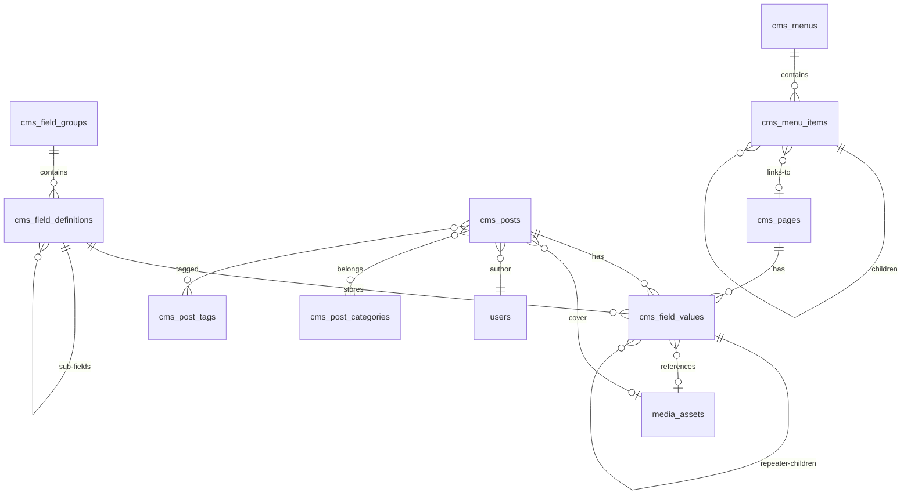
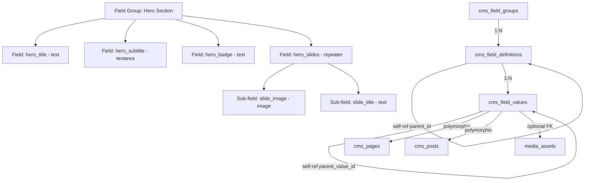
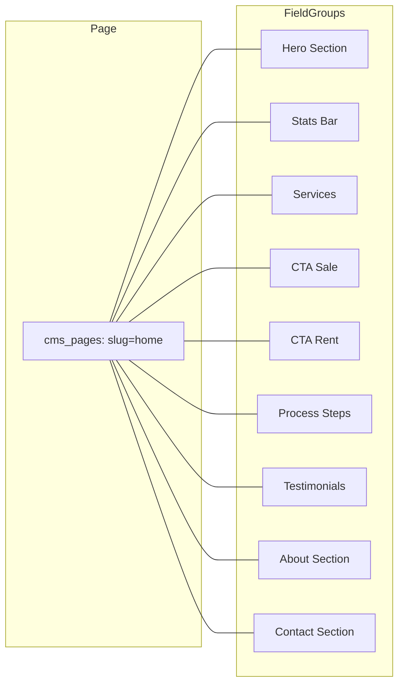
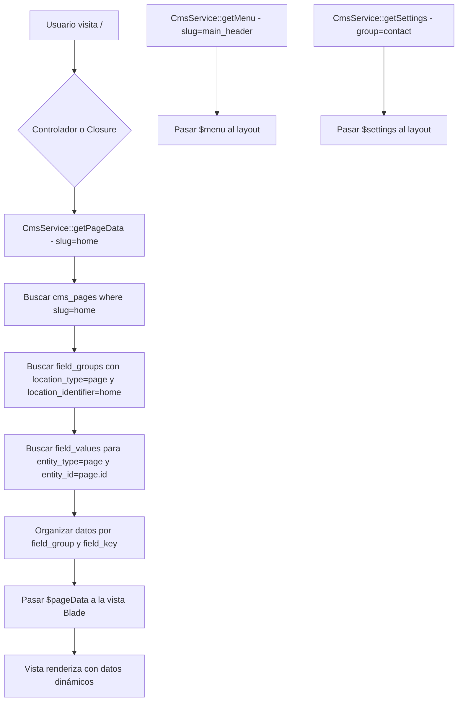

# Plan: Sistema CMS Administrable - San Miguel Properties

## Resumen Ejecutivo

Diseño de un sistema CMS tipo ACF (Advanced Custom Fields) para hacer administrable toda la parte pública del sitio: páginas estáticas, blog/posts, menús de navegación, información de contacto y SEO. Todo con soporte bilingüe (ES/EN).

---

## Estado Actual

### Páginas Públicas con Contenido Hardcodeado
| Página | Ruta | Contenido Hardcodeado |
|--------|------|----------------------|
| Home | `/` | Hero, Stats, Servicios, CTAs, Propiedades, Proceso, Testimonios, About, Contacto |
| Nosotros | `/nosotros` | Hero, Descripción, Valores, Timeline, Equipo |
| Contacto | `/contacto` | Hero, Formulario, Info de contacto |

### Páginas Públicas Dinámicas (ya funcionales)
| Página | Ruta | Fuente |
|--------|------|--------|
| Propiedades | `/propiedades` | API REST |
| Detalle Propiedad | `/propiedades/{id}` | API REST |
| Agencias MLS | `/agencias` | API REST |
| Agentes MLS | `/agentes` | API REST |

### Lo que NO es administrable actualmente
- Textos de títulos, subtítulos, descripciones en páginas estáticas
- Imágenes de fondo y decorativas
- Estadísticas (500+, 15+, etc.)
- Testimonios
- Pasos del proceso
- Miembros del equipo
- Información de contacto (teléfono, email, WhatsApp)
- Menú de navegación (header/footer)
- Meta tags SEO

---

## Arquitectura de Base de Datos

### Diagrama ER Principal



### Diagrama de Flujo: Cómo se Relacionan los Campos



---

## Tablas de Base de Datos

### 1. `cms_pages` - Páginas Estáticas

```
id                    BIGINT UNSIGNED PK AUTO_INCREMENT
slug                  VARCHAR 100 UNIQUE NOT NULL -- home, about, contact
title_es              VARCHAR 255 NOT NULL
title_en              VARCHAR 255 NULL
meta_title_es         VARCHAR 255 NULL
meta_title_en         VARCHAR 255 NULL
meta_description_es   TEXT NULL
meta_description_en   TEXT NULL
meta_keywords_es      VARCHAR 500 NULL
meta_keywords_en      VARCHAR 500 NULL
template              VARCHAR 100 NULL -- blade template name
status                ENUM draft,published,archived DEFAULT published
is_active             BOOLEAN DEFAULT true
sort_order            INTEGER DEFAULT 0
created_by            BIGINT UNSIGNED NULL FK users.id
created_at            TIMESTAMP
updated_at            TIMESTAMP
```

### 2. `cms_posts` - Publicaciones / Blog

```
id                    BIGINT UNSIGNED PK AUTO_INCREMENT
slug                  VARCHAR 255 UNIQUE NOT NULL
title_es              VARCHAR 255 NOT NULL
title_en              VARCHAR 255 NULL
excerpt_es            TEXT NULL
excerpt_en            TEXT NULL
body_es               LONGTEXT NULL
body_en               LONGTEXT NULL
cover_media_asset_id  BIGINT UNSIGNED NULL FK media_assets.id
author_id             BIGINT UNSIGNED NULL FK users.id
status                ENUM draft,published,scheduled,archived DEFAULT draft
is_featured           BOOLEAN DEFAULT false
published_at          TIMESTAMP NULL
meta_title_es         VARCHAR 255 NULL
meta_title_en         VARCHAR 255 NULL
meta_description_es   TEXT NULL
meta_description_en   TEXT NULL
sort_order            INTEGER DEFAULT 0
created_at            TIMESTAMP
updated_at            TIMESTAMP
```

### 3. `cms_post_categories` - Categorías de Posts

```
id                    BIGINT UNSIGNED PK AUTO_INCREMENT
slug                  VARCHAR 100 UNIQUE NOT NULL
name_es               VARCHAR 255 NOT NULL
name_en               VARCHAR 255 NULL
description_es        TEXT NULL
description_en        TEXT NULL
cover_media_asset_id  BIGINT UNSIGNED NULL FK media_assets.id
parent_id             BIGINT UNSIGNED NULL FK cms_post_categories.id
sort_order            INTEGER DEFAULT 0
is_active             BOOLEAN DEFAULT true
created_at            TIMESTAMP
updated_at            TIMESTAMP
```

### 4. `cms_post_category` - Pivot Posts-Categorías

```
cms_post_id           BIGINT UNSIGNED FK cms_posts.id ON DELETE CASCADE
cms_post_category_id  BIGINT UNSIGNED FK cms_post_categories.id ON DELETE CASCADE
PRIMARY KEY (cms_post_id, cms_post_category_id)
```

### 5. `cms_post_tags` - Tags de Posts

```
id                    BIGINT UNSIGNED PK AUTO_INCREMENT
slug                  VARCHAR 100 UNIQUE NOT NULL
name_es               VARCHAR 255 NOT NULL
name_en               VARCHAR 255 NULL
created_at            TIMESTAMP
updated_at            TIMESTAMP
```

### 6. `cms_post_tag` - Pivot Posts-Tags

```
cms_post_id           BIGINT UNSIGNED FK cms_posts.id ON DELETE CASCADE
cms_post_tag_id       BIGINT UNSIGNED FK cms_post_tags.id ON DELETE CASCADE
PRIMARY KEY (cms_post_id, cms_post_tag_id)
```

### 7. `cms_field_groups` - Grupos de Campos (como ACF Field Groups)

```
id                    BIGINT UNSIGNED PK AUTO_INCREMENT
name                  VARCHAR 255 NOT NULL -- Admin label
slug                  VARCHAR 100 UNIQUE NOT NULL -- machine name
description           TEXT NULL
location_type         ENUM page,post,post_category,global NOT NULL
location_identifier   VARCHAR 100 NULL -- slug de página específica, NULL = aplica a todos
sort_order            INTEGER DEFAULT 0
is_active             BOOLEAN DEFAULT true
created_at            TIMESTAMP
updated_at            TIMESTAMP
```

> **Nota sobre `location_type` + `location_identifier`:**
> - `location_type=page, location_identifier=home` → Solo aplica a la página Home
> - `location_type=post, location_identifier=NULL` → Aplica a TODOS los posts
> - `location_type=global, location_identifier=NULL` → Campos globales

### 8. `cms_field_definitions` - Definiciones de Campos

```
id                    BIGINT UNSIGNED PK AUTO_INCREMENT
field_group_id        BIGINT UNSIGNED NOT NULL FK cms_field_groups.id ON DELETE CASCADE
parent_id             BIGINT UNSIGNED NULL FK cms_field_definitions.id ON DELETE CASCADE
field_key             VARCHAR 100 NOT NULL -- machine name, unique per group
type                  VARCHAR 50 NOT NULL -- ver tipos abajo
label_es              VARCHAR 255 NOT NULL
label_en              VARCHAR 255 NULL
instructions_es       TEXT NULL -- help text para el admin
instructions_en       TEXT NULL
placeholder_es        VARCHAR 255 NULL
placeholder_en        VARCHAR 255 NULL
default_value_es      TEXT NULL
default_value_en      TEXT NULL
validation_rules      JSON NULL -- {min, max, regex, etc.}
options               JSON NULL -- choices para select/radio/checkbox, config para repeater
is_required           BOOLEAN DEFAULT false
is_translatable       BOOLEAN DEFAULT true -- false para numbers, colors, booleans
char_limit            INTEGER UNSIGNED NULL
sort_order            INTEGER DEFAULT 0
created_at            TIMESTAMP
updated_at            TIMESTAMP

UNIQUE INDEX (field_group_id, field_key)
```

#### Tipos de Campo Soportados

| Tipo | Descripción | Almacenamiento |
|------|-------------|----------------|
| `text` | Texto corto de una línea | value_es / value_en |
| `textarea` | Texto multi-línea sin formato | value_es / value_en |
| `wysiwyg` | Editor WYSIWYG con HTML | value_es / value_en |
| `number` | Valor numérico | value_es (is_translatable=false) |
| `url` | URL / enlace | value_es / value_en |
| `email` | Dirección de correo | value_es (is_translatable=false) |
| `phone` | Número de teléfono | value_es (is_translatable=false) |
| `image` | Imagen única | media_asset_id |
| `gallery` | Galería de imágenes | Múltiples rows con media_asset_id |
| `file` | Archivo adjunto | media_asset_id |
| `select` | Dropdown de opciones | value_es, opciones en JSON |
| `checkbox` | Múltiple selección | value_es = JSON array |
| `radio` | Selección única | value_es |
| `boolean` | Toggle true/false | value_es = 1 o 0 |
| `color` | Selector de color | value_es = hex code |
| `date` | Selector de fecha | value_es = Y-m-d |
| `datetime` | Fecha y hora | value_es = Y-m-d H:i:s |
| `link` | URL + label + target | value_es = JSON |
| `repeater` | Grupo repetible de sub-campos | Sub-fields via parent_id |
| `group` | Grupo de sub-campos (no repetible) | Sub-fields via parent_id |
| `icon` | Selector de icono SVG | value_es = SVG string o class |

### 9. `cms_field_values` - Valores de Campos

```
id                    BIGINT UNSIGNED PK AUTO_INCREMENT
field_definition_id   BIGINT UNSIGNED NOT NULL FK cms_field_definitions.id ON DELETE CASCADE
entity_type           VARCHAR 50 NOT NULL -- page, post, global
entity_id             BIGINT UNSIGNED NULL -- FK a cms_pages.id o cms_posts.id, NULL para global
value_es              LONGTEXT NULL
value_en              LONGTEXT NULL
media_asset_id        BIGINT UNSIGNED NULL FK media_assets.id ON DELETE SET NULL
parent_value_id       BIGINT UNSIGNED NULL FK cms_field_values.id ON DELETE CASCADE
row_index             INTEGER UNSIGNED DEFAULT 0 -- orden dentro del repeater
created_at            TIMESTAMP
updated_at            TIMESTAMP

INDEX (entity_type, entity_id)
INDEX (field_definition_id)
INDEX (parent_value_id)
```

### 10. `cms_menus` - Definición de Menús

```
id                    BIGINT UNSIGNED PK AUTO_INCREMENT
name                  VARCHAR 255 NOT NULL -- Admin label
slug                  VARCHAR 100 UNIQUE NOT NULL -- main_header, footer_links, etc.
location              VARCHAR 100 NOT NULL -- header, footer_col_1, footer_col_2, footer_bottom
description           TEXT NULL
is_active             BOOLEAN DEFAULT true
created_at            TIMESTAMP
updated_at            TIMESTAMP
```

### 11. `cms_menu_items` - Ítems del Menú

```
id                    BIGINT UNSIGNED PK AUTO_INCREMENT
menu_id               BIGINT UNSIGNED NOT NULL FK cms_menus.id ON DELETE CASCADE
parent_id             BIGINT UNSIGNED NULL FK cms_menu_items.id ON DELETE CASCADE
label_es              VARCHAR 255 NOT NULL
label_en              VARCHAR 255 NULL
url                   VARCHAR 500 NULL -- enlace externo
route_name            VARCHAR 255 NULL -- nombre de ruta Laravel
page_id               BIGINT UNSIGNED NULL FK cms_pages.id ON DELETE SET NULL
target                VARCHAR 20 DEFAULT _self -- _self, _blank
icon                  TEXT NULL -- SVG inline o class
css_class             VARCHAR 255 NULL
sort_order            INTEGER DEFAULT 0
is_active             BOOLEAN DEFAULT true
created_at            TIMESTAMP
updated_at            TIMESTAMP
```

### 12. `cms_site_settings` - Configuración Global del Sitio

```
id                    BIGINT UNSIGNED PK AUTO_INCREMENT
setting_key           VARCHAR 100 UNIQUE NOT NULL
setting_group         VARCHAR 50 NOT NULL -- contact, social, general, seo, company
label_es              VARCHAR 255 NOT NULL
label_en              VARCHAR 255 NULL
type                  VARCHAR 50 NOT NULL -- text, textarea, image, url, email, phone, boolean
value_es              TEXT NULL
value_en              TEXT NULL
media_asset_id        BIGINT UNSIGNED NULL FK media_assets.id ON DELETE SET NULL
sort_order            INTEGER DEFAULT 0
created_at            TIMESTAMP
updated_at            TIMESTAMP
```

---

## Ejemplo Práctico: Página Home

### Cómo se mapea el contenido actual del Home a la estructura CMS



### Ejemplo: Field Group "Hero Section" para Home

| Field Key | Tipo | Label ES | Translatable |
|-----------|------|----------|-------------|
| `hero_badge_text` | text | Texto del badge | Sí |
| `hero_title_line1` | text | Título línea 1 | Sí |
| `hero_title_highlight` | text | Título destacado | Sí |
| `hero_subtitle` | textarea | Subtítulo | Sí |
| `hero_search_placeholder` | text | Placeholder del buscador | Sí |
| `hero_search_button` | text | Texto botón buscar | Sí |
| `hero_scroll_text` | text | Texto scroll indicator | Sí |
| `hero_background_image` | image | Imagen de fondo por defecto | No |

### Ejemplo: Field Group "Stats Bar" para Home

| Field Key | Tipo | Label ES | Translatable |
|-----------|------|----------|-------------|
| `stats_items` | repeater | Estadísticas | - |
| → `stat_number` | text | Número (ej: 500+) | Sí |
| → `stat_label` | text | Etiqueta | Sí |

### Ejemplo: Field Group "Testimonials" para Home

| Field Key | Tipo | Label ES | Translatable |
|-----------|------|----------|-------------|
| `testimonials_badge` | text | Badge de sección | Sí |
| `testimonials_title` | text | Título de sección | Sí |
| `testimonials_subtitle` | text | Subtítulo | Sí |
| `testimonials_items` | repeater | Testimonios | - |
| → `testimonial_text` | textarea | Texto del testimonio | Sí |
| → `testimonial_name` | text | Nombre del cliente | No |
| → `testimonial_role` | text | Rol/ubicación | Sí |
| → `testimonial_avatar` | image | Foto del cliente | No |
| → `testimonial_rating` | number | Calificación (1-5) | No |

---

## API Endpoints

### Rutas Públicas (sin auth)

```
GET  /api/public/cms/pages/{slug}              → Página con campos y valores
GET  /api/public/cms/posts                     → Listado de posts (paginado)
GET  /api/public/cms/posts/{slug}              → Detalle de un post con campos
GET  /api/public/cms/posts/categories           → Categorías de posts
GET  /api/public/cms/posts/tags                → Tags de posts
GET  /api/public/cms/menus/{slug}              → Menú con sus items
GET  /api/public/cms/settings/{group}          → Settings de un grupo
GET  /api/public/cms/settings                  → Todos los settings
```

### Rutas Protegidas (admin)

```
-- Páginas --
GET    /api/cms/pages                          → Listado de páginas
POST   /api/cms/pages                          → Crear página
GET    /api/cms/pages/{id}                     → Ver página
PUT    /api/cms/pages/{id}                     → Actualizar página
DELETE /api/cms/pages/{id}                     → Eliminar página

-- Posts --
GET    /api/cms/posts                          → Listado de posts
POST   /api/cms/posts                          → Crear post
GET    /api/cms/posts/{id}                     → Ver post
PUT    /api/cms/posts/{id}                     → Actualizar post
DELETE /api/cms/posts/{id}                     → Eliminar post

-- Categorías --
GET    /api/cms/post-categories                → CRUD categorías
POST   /api/cms/post-categories
PUT    /api/cms/post-categories/{id}
DELETE /api/cms/post-categories/{id}

-- Tags --
GET    /api/cms/post-tags                      → CRUD tags
POST   /api/cms/post-tags
PUT    /api/cms/post-tags/{id}
DELETE /api/cms/post-tags/{id}

-- Field Groups --
GET    /api/cms/field-groups                   → Listado grupos
POST   /api/cms/field-groups                   → Crear grupo
GET    /api/cms/field-groups/{id}              → Ver grupo con definiciones
PUT    /api/cms/field-groups/{id}              → Actualizar grupo
DELETE /api/cms/field-groups/{id}              → Eliminar grupo

-- Field Definitions --
POST   /api/cms/field-definitions              → Crear campo
PUT    /api/cms/field-definitions/{id}         → Actualizar campo
DELETE /api/cms/field-definitions/{id}         → Eliminar campo
POST   /api/cms/field-definitions/reorder      → Reordenar campos

-- Field Values --
GET    /api/cms/field-values/{entityType}/{entityId}  → Valores de una entidad
PUT    /api/cms/field-values/{entityType}/{entityId}  → Guardar/actualizar valores
POST   /api/cms/field-values/repeater-row       → Agregar fila de repeater
DELETE /api/cms/field-values/repeater-row/{id}  → Eliminar fila de repeater

-- Menús --
GET    /api/cms/menus                          → Listado menús
POST   /api/cms/menus                          → Crear menú
PUT    /api/cms/menus/{id}                     → Actualizar menú
DELETE /api/cms/menus/{id}                     → Eliminar menú

-- Menu Items --
POST   /api/cms/menu-items                     → Crear item
PUT    /api/cms/menu-items/{id}                → Actualizar item
DELETE /api/cms/menu-items/{id}                → Eliminar item
POST   /api/cms/menu-items/reorder             → Reordenar items

-- Site Settings --
GET    /api/cms/settings                       → Todos los settings
GET    /api/cms/settings/{group}               → Settings por grupo
PUT    /api/cms/settings                       → Actualizar settings (bulk)
PUT    /api/cms/settings/{key}                 → Actualizar setting individual
```

---

## Modelos Eloquent

### Modelos a Crear

| Modelo | Tabla | Relaciones Principales |
|--------|-------|----------------------|
| `CmsPage` | cms_pages | hasMany FieldValues, belongsTo User |
| `CmsPost` | cms_posts | hasMany FieldValues, belongsTo User, belongsTo MediaAsset, belongsToMany Categories/Tags |
| `CmsPostCategory` | cms_post_categories | belongsToMany Posts, self-ref parent |
| `CmsPostTag` | cms_post_tags | belongsToMany Posts |
| `CmsFieldGroup` | cms_field_groups | hasMany FieldDefinitions |
| `CmsFieldDefinition` | cms_field_definitions | belongsTo FieldGroup, self-ref parent, hasMany FieldValues |
| `CmsFieldValue` | cms_field_values | belongsTo FieldDefinition, belongsTo MediaAsset, self-ref parent, morphTo entity |
| `CmsMenu` | cms_menus | hasMany MenuItems |
| `CmsMenuItem` | cms_menu_items | belongsTo Menu, self-ref parent, belongsTo CmsPage |
| `CmsSiteSetting` | cms_site_settings | belongsTo MediaAsset |

---

## Site Settings Pre-definidos

### Grupo: `contact`

| Key | Tipo | Label | Valor Ejemplo |
|-----|------|-------|---------------|
| `contact_phone` | phone | Teléfono principal | +52 55 1234 5678 |
| `contact_phone_secondary` | phone | Teléfono secundario | - |
| `contact_email` | email | Email principal | info@sanmiguelproperties.com |
| `contact_whatsapp` | phone | WhatsApp | +525512345678 |
| `contact_address` | textarea | Dirección | San Miguel de Allende, GTO |

### Grupo: `social`

| Key | Tipo | Label | Valor Ejemplo |
|-----|------|-------|---------------|
| `social_facebook` | url | Facebook | https://facebook.com/... |
| `social_instagram` | url | Instagram | https://instagram.com/... |
| `social_twitter` | url | Twitter/X | https://x.com/... |
| `social_linkedin` | url | LinkedIn | https://linkedin.com/... |
| `social_youtube` | url | YouTube | - |
| `social_tiktok` | url | TikTok | - |

### Grupo: `general`

| Key | Tipo | Label | Valor Ejemplo |
|-----|------|-------|---------------|
| `site_name` | text | Nombre del sitio | San Miguel Properties |
| `site_tagline` | text | Tagline | Encuentra tu hogar ideal |
| `site_logo` | image | Logo principal | media_asset_id |
| `site_logo_dark` | image | Logo tema oscuro | media_asset_id |
| `site_favicon` | image | Favicon | media_asset_id |
| `copyright_text` | text | Texto copyright | 2024 San Miguel Properties |

### Grupo: `seo`

| Key | Tipo | Label | Valor Ejemplo |
|-----|------|-------|---------------|
| `default_meta_title` | text | Meta título por defecto | San Miguel Properties |
| `default_meta_description` | textarea | Meta descripción por defecto | - |
| `google_analytics_id` | text | Google Analytics ID | GA-XXXXXXX |
| `google_tag_manager_id` | text | GTM ID | GTM-XXXXXXX |

### Grupo: `company`

| Key | Tipo | Label | Valor Ejemplo |
|-----|------|-------|---------------|
| `company_name` | text | Nombre legal | San Miguel Properties S.A. de C.V. |
| `company_rfc` | text | RFC | XXXX000000XXX |
| `office_hours` | text | Horario | Lunes a Viernes 9:00 - 18:00 |

---

## Menús Pre-definidos

### Menú: `main_header` (Navegación Principal)

```json
[
  { "label_es": "Inicio", "label_en": "Home", "route_name": "home" },
  { "label_es": "Propiedades", "label_en": "Properties", "route_name": "public.properties.index" },
  { "label_es": "Agencias", "label_en": "Agencies", "route_name": "public.mls-offices.index" },
  { "label_es": "Agentes", "label_en": "Agents", "route_name": "public.mls-agents.index" },
  { "label_es": "Nosotros", "label_en": "About Us", "route_name": "about" },
  { "label_es": "Blog", "label_en": "Blog", "route_name": "public.blog.index" },
  { "label_es": "Contacto", "label_en": "Contact", "route_name": "public.contact" }
]
```

### Menú: `footer_company` (Footer - Columna Empresa)

```json
[
  { "label_es": "Sobre nosotros", "route_name": "about" },
  { "label_es": "Nuestro equipo", "url": "/nosotros#equipo" },
  { "label_es": "Blog", "route_name": "public.blog.index" },
  { "label_es": "Contacto", "route_name": "public.contact" }
]
```

### Menú: `footer_services` (Footer - Columna Servicios)

```json
[
  { "label_es": "Comprar", "url": "/propiedades?operation_type=sale" },
  { "label_es": "Rentar", "url": "/propiedades?operation_type=rental" },
  { "label_es": "Vender", "route_name": "public.contact" },
  { "label_es": "Invertir", "route_name": "public.contact" }
]
```

---

## Estructura de Archivos a Crear/Modificar

### Nuevos Archivos

```
database/migrations/
├── 2026_02_21_000100_create_cms_pages_table.php
├── 2026_02_21_000200_create_cms_posts_table.php
├── 2026_02_21_000300_create_cms_post_categories_table.php
├── 2026_02_21_000400_create_cms_post_tags_table.php
├── 2026_02_21_000500_create_cms_field_groups_table.php
├── 2026_02_21_000600_create_cms_field_definitions_table.php
├── 2026_02_21_000700_create_cms_field_values_table.php
├── 2026_02_21_000800_create_cms_menus_table.php
├── 2026_02_21_000900_create_cms_menu_items_table.php
├── 2026_02_21_001000_create_cms_site_settings_table.php
├── 2026_02_21_001100_create_cms_post_category_pivot.php
└── 2026_02_21_001200_create_cms_post_tag_pivot.php

app/Models/
├── CmsPage.php
├── CmsPost.php
├── CmsPostCategory.php
├── CmsPostTag.php
├── CmsFieldGroup.php
├── CmsFieldDefinition.php
├── CmsFieldValue.php
├── CmsMenu.php
├── CmsMenuItem.php
└── CmsSiteSetting.php

app/Http/Controllers/
├── CmsPageController.php
├── CmsPostController.php
├── CmsPostCategoryController.php
├── CmsPostTagController.php
├── CmsFieldGroupController.php
├── CmsFieldDefinitionController.php
├── CmsFieldValueController.php
├── CmsMenuController.php
├── CmsMenuItemController.php
└── CmsSiteSettingController.php

app/Services/
└── CmsService.php              -- Lógica de negocio CMS (helper para resolver campos, cache, etc.)

database/seeders/
├── CmsPageSeeder.php           -- Páginas existentes (home, about, contact)
├── CmsFieldGroupSeeder.php     -- Field groups para cada página
├── CmsFieldDefinitionSeeder.php -- Definiciones de campos
├── CmsFieldValueSeeder.php     -- Valores actuales (contenido hardcoded migrado)
├── CmsMenuSeeder.php           -- Menús header/footer
├── CmsMenuItemSeeder.php       -- Items de menú
└── CmsSiteSettingSeeder.php    -- Settings de contacto, social, etc.

resources/views/
├── cms/                        -- Vistas admin del CMS
│   ├── pages/
│   │   └── manage.blade.php
│   ├── posts/
│   │   └── manage.blade.php
│   ├── field-groups/
│   │   └── manage.blade.php
│   ├── menus/
│   │   └── manage.blade.php
│   └── settings/
│       └── manage.blade.php
└── public/
    ├── blog-index.blade.php    -- Listado de posts
    └── blog-detail.blade.php   -- Detalle de un post
```

### Archivos a Modificar

```
routes/api.php                  -- Agregar rutas CMS
routes/views.php                -- Agregar rutas del blog + rutas CMS admin
resources/views/home.blade.php  -- Leer contenido desde CMS
resources/views/public/about.blade.php    -- Leer contenido desde CMS
resources/views/public/contact.blade.php  -- Leer contenido desde CMS
resources/views/layouts/public.blade.php  -- Menú y footer dinámicos
resources/views/dashboard.blade.php       -- Agregar sección CMS al menú admin
```

---

## Flujo de Rendering en Frontend



### Helper de ejemplo en Blade

```php
// En el controlador o route closure:
$pageData = CmsService::getPageData('home');
$menu = CmsService::getMenu('main_header');
$settings = CmsService::getSettings(['contact', 'social']);

return view('home', compact('pageData', 'menu', 'settings'));

// En Blade (ejemplo para campo de texto):
{{ $pageData->field('hero_title_line1') }}           // Devuelve ES o EN según locale
{{ $pageData->field('hero_title_line1', 'en') }}     // Fuerza EN

// Para repeater:
@foreach($pageData->repeater('testimonials_items') as $testimonial)
    {{ $testimonial->field('testimonial_name') }}
    {{ $testimonial->field('testimonial_text') }}
@endforeach

// Para imagen:
image('hero_background_image') }}" />
```

---

## Fases de Implementación

### Fase 1: Base de Datos y Modelos
- Crear todas las migraciones
- Crear todos los modelos Eloquent con relaciones
- Crear CmsService (lógica de negocio y helpers)

### Fase 2: API Backend
- Crear controllers para admin CRUD
- Crear controllers para public read
- Registrar rutas en api.php y views.php

### Fase 3: Seeders (Migrar contenido actual)
- Crear páginas home, about, contact
- Crear field groups y definiciones para cada sección de cada página
- Migrar todo el contenido hardcodeado actual a field_values
- Crear menús con items actuales
- Crear site settings con info de contacto actual

### Fase 4: Panel Admin
- Vista de gestión de páginas
- Vista de gestión de posts/blog
- Vista de gestión de field groups y campos
- Vista de gestión de menús
- Vista de gestión de site settings
- Editor de campos tipo ACF (con soporte para repeaters)

### Fase 5: Frontend Público
- Adaptar layout público (header/footer dinámicos)
- Adaptar home.blade.php para leer del CMS
- Adaptar about.blade.php para leer del CMS
- Adaptar contact.blade.php para leer del CMS
- Crear vistas de blog (listado y detalle)
- Implementar soporte de idioma (ES/EN toggle)

### Fase 6: Testing y Polish
- Tests unitarios para CmsService
- Tests de integración para API endpoints
- Verificar que el contenido actual se muestra correctamente
- Cache de consultas CMS para rendimiento
- Optimización de queries (eager loading)

---

## Consideraciones Técnicas

### Performance
- Cache agresivo de field_values por página (misma estrategia que FrontendColorSetting)
- Eager loading de relaciones en consultas
- Índices en columnas de búsqueda frecuente

### Seguridad
- Validación de tipos de campo en el backend
- Sanitización de HTML en campos WYSIWYG
- Rutas admin protegidas con middleware auth + admin

### Bilingüe
- Cada campo de texto tiene `value_es` y `value_en`
- El helper `field()` detecta el locale actual de Laravel
- Campos no traducibles (number, boolean, color) solo usan `value_es`

### Media Assets
- Reutilización del sistema MediaAsset existente
- Los campos de tipo image/file/gallery apuntan a media_assets.id
- Compatible con el Media Picker ya implementado
