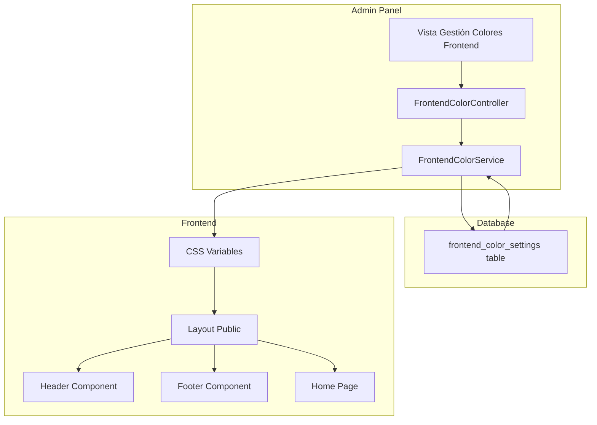
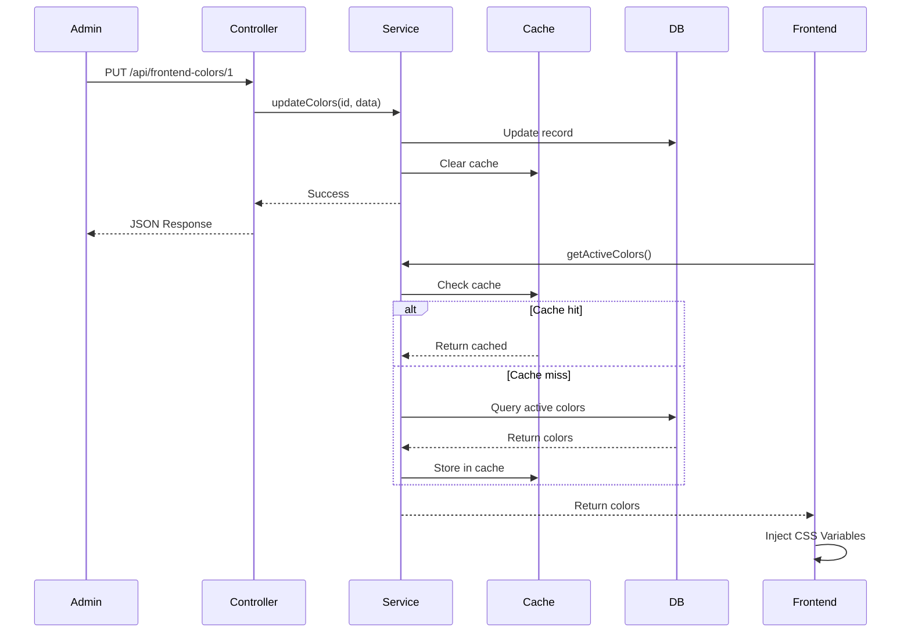

# Plan: Sistema de Administración de Colores del Frontend

> **Estado**: ✅ **IMPLEMENTADO** - 2026-01-09
> **Decisión**: Tabla simple con JSON único y TODOS los colores disponibles para modificar (máxima flexibilidad)

## Archivos Creados/Modificados

### Nuevos archivos creados:
- `database/migrations/2026_01_09_165900_create_frontend_color_settings_table.php`
- `app/Models/FrontendColorSetting.php`
- `app/Services/FrontendColorService.php`
- `app/Http/Controllers/FrontendColorController.php`
- `database/seeders/FrontendColorSettingsSeeder.php`
- `docs/api/frontend-colors.md`

### Archivos modificados:
- `routes/api.php` - Agregadas rutas para colores del frontend
- `database/seeders/DatabaseSeeder.php` - Agregado el seeder
- `resources/views/layouts/public.blade.php` - Inyección de variables CSS dinámicas

## Próximos Pasos
1. Ejecutar `php artisan migrate` para crear la tabla
2. Ejecutar `php artisan db:seed --class=FrontendColorSettingsSeeder` para crear configuración inicial
3. Crear la vista de administración en el panel (fase futura)

---

## Resumen Ejecutivo

Implementar un sistema para administrar los colores del frontend (página de inicio y páginas públicas) desde el panel de administración. Los colores serán **globales** (no por usuario) y afectarán a todo el sitio público.

## Análisis de Colores Identificados

### 1. Colores Primarios y Gradientes

| Variable | Uso Actual | Descripción |
|----------|------------|-------------|
| `primary-600` | `#4f46e5` (indigo-600) | Color primario principal |
| `primary-400` | `#818cf8` (indigo-400) | Color primario claro |
| `accent-500` | `#10b981` (emerald-500) | Color de acento principal |
| `accent-400` | `#34d399` (emerald-400) | Color de acento claro |

### 2. Gradientes Principales

| Nombre | Colores Actuales | Uso |
|--------|------------------|-----|
| `gradient-primary` | `indigo-600 → emerald-500` | Botones CTA, logo, badges |
| `gradient-hero-title` | `indigo-400 → purple-400 → emerald-400` | Título hero "hogar ideal" |
| `gradient-stats-1` | `indigo-600 → indigo-400` | Stat "Propiedades" |
| `gradient-stats-2` | `emerald-600 → emerald-400` | Stat "Años experiencia" |
| `gradient-stats-3` | `purple-600 → purple-400` | Stat "Clientes felices" |
| `gradient-stats-4` | `amber-600 → amber-400` | Stat "Zonas cubiertas" |

### 3. Colores de Features/Servicios

| Feature | Color Actual | Variable Propuesta |
|---------|--------------|-------------------|
| Búsqueda Inteligente | `indigo-600 → indigo-400` | `feature-search` |
| Transacciones Seguras | `emerald-600 → emerald-400` | `feature-security` |
| Tours Virtuales | `purple-600 → purple-400` | `feature-tours` |
| Asesores Expertos | `amber-500 → amber-400` | `feature-advisors` |
| Financiamiento | `rose-500 → rose-400` | `feature-financing` |
| App Móvil | `cyan-500 → cyan-400` | `feature-app` |

### 4. Colores de Secciones CTA

| Sección | Color Overlay | Colores Accent |
|---------|---------------|----------------|
| Venta | `indigo-900` | `emerald-400 → cyan-400` |
| Renta | `slate-900` | `amber-400 → orange-400` |

### 5. Colores de Pasos/Proceso

| Paso | Color Actual | 
|------|--------------|
| Paso 1 | `indigo-600 → indigo-400` |
| Paso 2 | `purple-600 → purple-400` |
| Paso 3 | `cyan-600 → cyan-400` |
| Paso 4 | `emerald-600 → emerald-400` |

### 6. Colores de Footer y Header

| Elemento | Color Actual |
|----------|--------------|
| Footer background | `slate-900` |
| Footer accent 1 | `indigo-600` |
| Footer accent 2 | `emerald-500` |
| Header gradient | `indigo-600 → emerald-500` |

### 7. Colores de Estado/Operación

| Estado | Color Actual |
|--------|--------------|
| En Venta | `emerald-500` |
| En Renta | `amber-500` |
| Favorito hover | `rose-500` |
| Publicado activo | `indigo-600 → emerald-500` |

---

## Arquitectura Propuesta

### Estructura de Datos

```json
{
  "primary": {
    "from": "#4f46e5",
    "to": "#10b981"
  },
  "hero": {
    "title_gradient_from": "#818cf8",
    "title_gradient_via": "#c084fc",
    "title_gradient_to": "#34d399",
    "overlay_from": "#000000",
    "overlay_to": "#000000"
  },
  "stats": {
    "properties": { "from": "#4f46e5", "to": "#818cf8" },
    "experience": { "from": "#059669", "to": "#34d399" },
    "clients": { "from": "#9333ea", "to": "#c084fc" },
    "zones": { "from": "#d97706", "to": "#fbbf24" }
  },
  "features": {
    "search": { "from": "#4f46e5", "to": "#818cf8", "hover_border": "#c7d2fe" },
    "security": { "from": "#059669", "to": "#34d399", "hover_border": "#a7f3d0" },
    "tours": { "from": "#9333ea", "to": "#c084fc", "hover_border": "#e9d5ff" },
    "advisors": { "from": "#f59e0b", "to": "#fbbf24", "hover_border": "#fde68a" },
    "financing": { "from": "#f43f5e", "to": "#fb7185", "hover_border": "#fecdd3" },
    "app": { "from": "#06b6d4", "to": "#22d3ee", "hover_border": "#a5f3fc" }
  },
  "cta_sale": {
    "overlay": "#312e81",
    "accent_from": "#34d399",
    "accent_to": "#22d3ee",
    "button_from": "#10b981",
    "button_to": "#06b6d4"
  },
  "cta_rent": {
    "overlay": "#0f172a",
    "accent_from": "#fbbf24",
    "accent_to": "#fb923c",
    "button_from": "#f59e0b",
    "button_to": "#f97316"
  },
  "process_steps": {
    "step1": { "from": "#4f46e5", "to": "#818cf8" },
    "step2": { "from": "#9333ea", "to": "#c084fc" },
    "step3": { "from": "#06b6d4", "to": "#22d3ee" },
    "step4": { "from": "#059669", "to": "#34d399" }
  },
  "testimonials": {
    "star": "#fbbf24",
    "quote_1": "#e0e7ff",
    "quote_2": "#d1fae5",
    "quote_3": "#f3e8ff",
    "avatar_1_from": "#4f46e5",
    "avatar_1_to": "#10b981",
    "avatar_2_from": "#9333ea",
    "avatar_2_to": "#ec4899",
    "avatar_3_from": "#f59e0b",
    "avatar_3_to": "#f97316"
  },
  "about": {
    "badge_bg": "#e0e7ff",
    "badge_text": "#4f46e5",
    "highlight": { "from": "#4f46e5", "to": "#10b981" },
    "check_1_bg": "#e0e7ff",
    "check_1_text": "#4f46e5",
    "check_2_bg": "#d1fae5",
    "check_2_text": "#059669",
    "check_3_bg": "#f3e8ff",
    "check_3_text": "#9333ea"
  },
  "contact": {
    "phone_icon_from": "#10b981",
    "phone_icon_to": "#059669",
    "whatsapp_icon_from": "#22c55e",
    "whatsapp_icon_to": "#16a34a",
    "email_icon_from": "#6366f1",
    "email_icon_to": "#4f46e5"
  },
  "footer": {
    "background": "#0f172a",
    "accent_from": "#4f46e5",
    "accent_to": "#10b981",
    "newsletter_button": { "from": "#4f46e5", "to": "#10b981" },
    "social_facebook_hover": "#4f46e5",
    "social_instagram_from": "#9333ea",
    "social_instagram_to": "#ec4899",
    "social_twitter_hover": "#0ea5e9",
    "social_whatsapp_hover": "#22c55e",
    "social_linkedin_hover": "#2563eb"
  },
  "header": {
    "logo_gradient_from": "#4f46e5",
    "logo_gradient_to": "#10b981",
    "cta_button_from": "#4f46e5",
    "cta_button_to": "#10b981",
    "nav_hover": "#4f46e5"
  },
  "property_cards": {
    "price_from": "#4f46e5",
    "price_to": "#10b981",
    "sale_badge": "#10b981",
    "rent_badge": "#f59e0b",
    "favorite_hover": "#f43f5e",
    "pagination_active_from": "#4f46e5",
    "pagination_active_to": "#10b981"
  },
  "filters": {
    "active_from": "#4f46e5",
    "active_to": "#10b981",
    "focus_border": "#6366f1"
  },
  "ui": {
    "back_to_top_from": "#4f46e5",
    "back_to_top_to": "#10b981",
    "preloader_border_1": "#4f46e5",
    "preloader_border_2": "#10b981",
    "scrollbar_from": "#6366f1",
    "scrollbar_to": "#10b981"
  }
}
```

---

## Diagrama de Arquitectura



---

## Archivos a Crear/Modificar

### Nuevos Archivos

| Archivo | Descripción |
|---------|-------------|
| `database/migrations/xxxx_create_frontend_color_settings_table.php` | Migración para la tabla |
| `app/Models/FrontendColorSetting.php` | Modelo Eloquent |
| `app/Services/FrontendColorService.php` | Servicio de lógica de negocio |
| `app/Http/Controllers/FrontendColorController.php` | Controlador API |
| `database/seeders/FrontendColorSettingsSeeder.php` | Seeder con colores por defecto |

### Archivos a Modificar

| Archivo | Cambios |
|---------|---------|
| `routes/api.php` | Agregar rutas para colores frontend |
| `routes/views.php` | Agregar ruta para vista de gestión |
| `resources/views/layouts/public.blade.php` | Inyectar variables CSS |
| `app/Providers/AppServiceProvider.php` | Opcional: compartir colores globalmente |

---

## Estructura de la Tabla

```sql
CREATE TABLE frontend_color_settings (
    id BIGINT UNSIGNED PRIMARY KEY AUTO_INCREMENT,
    key VARCHAR(100) UNIQUE NOT NULL,
    value TEXT NOT NULL,  -- JSON con los valores del color
    group VARCHAR(50) NOT NULL,  -- Grupo para organización: primary, hero, features, etc.
    label VARCHAR(255) NOT NULL,  -- Etiqueta legible para el admin
    description TEXT NULL,
    sort_order INT DEFAULT 0,
    is_active BOOLEAN DEFAULT TRUE,
    created_at TIMESTAMP NULL,
    updated_at TIMESTAMP NULL
);
```

### Alternativa: Tabla simple con JSON único

```sql
CREATE TABLE frontend_color_settings (
    id BIGINT UNSIGNED PRIMARY KEY AUTO_INCREMENT,
    name VARCHAR(100) UNIQUE DEFAULT 'default',
    colors JSON NOT NULL,  -- Todo el JSON de colores
    is_active BOOLEAN DEFAULT TRUE,
    created_at TIMESTAMP NULL,
    updated_at TIMESTAMP NULL
);
```

**Recomendación**: Usar la alternativa con JSON único, similar a `color_themes`, pero específico para frontend.

---

## API Endpoints

| Método | Endpoint | Descripción |
|--------|----------|-------------|
| GET | `/api/frontend-colors` | Obtener configuración de colores activa |
| GET | `/api/frontend-colors/all` | Obtener todas las configuraciones |
| POST | `/api/frontend-colors` | Crear nueva configuración |
| PUT | `/api/frontend-colors/{id}` | Actualizar configuración |
| DELETE | `/api/frontend-colors/{id}` | Eliminar configuración |
| POST | `/api/frontend-colors/{id}/activate` | Activar configuración |
| GET | `/api/frontend-colors/css` | Obtener CSS variables generado |

---

## Flujo de Implementación



---

## Consideraciones Técnicas

### 1. Caché
- Usar cache de 1 hora para los colores activos
- Invalidar cache al actualizar colores
- Key: `frontend_active_colors`

### 2. Variables CSS
Las variables se inyectarán en el layout público como:

```html
<style>
:root {
  --fe-primary-from: #4f46e5;
  --fe-primary-to: #10b981;
  --fe-hero-title-from: #818cf8;
  /* ... más variables */
}
</style>
```

### 3. Compatibilidad con Tailwind
En el layout público, configurar Tailwind para usar las variables CSS:

```javascript
tailwind.config = {
  theme: {
    extend: {
      colors: {
        'fe-primary': {
          from: 'var(--fe-primary-from)',
          to: 'var(--fe-primary-to)'
        }
        // ...
      }
    }
  }
}
```

### 4. Fallbacks
Siempre mantener valores por defecto en caso de que no haya configuración activa.

---

## Vista de Administración (Futura)

La vista para gestionar colores del frontend será similar a la de `color-themes/manage.blade.php` pero independiente y con los campos específicos del frontend:

- **Archivo**: `resources/views/frontend-colors/manage.blade.php`
- **Ruta**: `/admin/frontend-colors`
- **Características**:
  - Agrupación visual por secciones
  - Preview en tiempo real
  - Color pickers con conversión a hex
  - Botón para activar/desactivar configuración
  - Historial de cambios (opcional)

---

## Secuencia de Implementación

1. **Fase 1 - Backend Base**
   - Crear migración
   - Crear modelo
   - Crear seeder con valores por defecto
   - Ejecutar migración y seeder

2. **Fase 2 - Servicio y API**
   - Crear FrontendColorService
   - Crear FrontendColorController
   - Agregar rutas API
   - Probar endpoints

3. **Fase 3 - Integración Frontend**
   - Modificar layout público para inyectar CSS
   - Actualizar home.blade.php para usar variables
   - Actualizar header y footer

4. **Fase 4 - Vista Admin** (Posterior)
   - Crear vista de gestión
   - Implementar formulario con color pickers
   - Agregar preview en tiempo real

---

## Notas Importantes

1. **Independencia del Sistema de Dashboard**: Este sistema es completamente independiente del sistema de `ColorTheme` existente que se usa para el dashboard.

2. **Colores Globales**: Los cambios afectan a todo el frontend, no son por usuario.

3. **Sin Breaking Changes**: La implementación inicial no modificará los estilos actuales hasta que se active la funcionalidad.

4. **Extensibilidad**: La estructura JSON permite agregar nuevos colores sin modificar el esquema de la base de datos.
